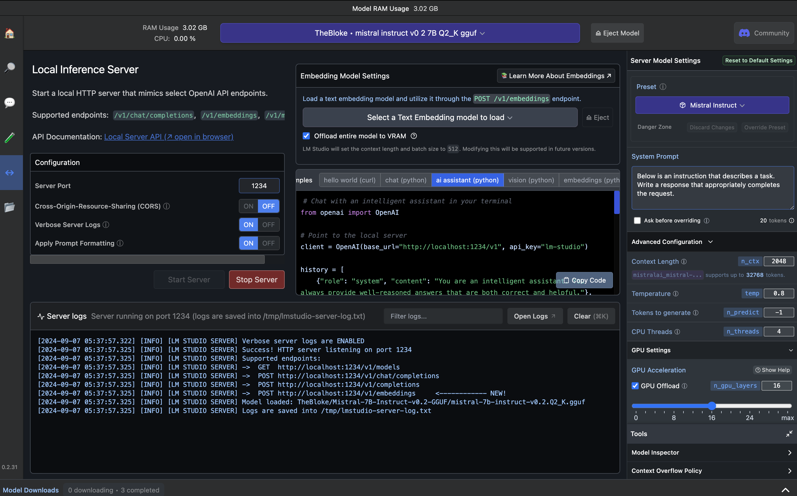
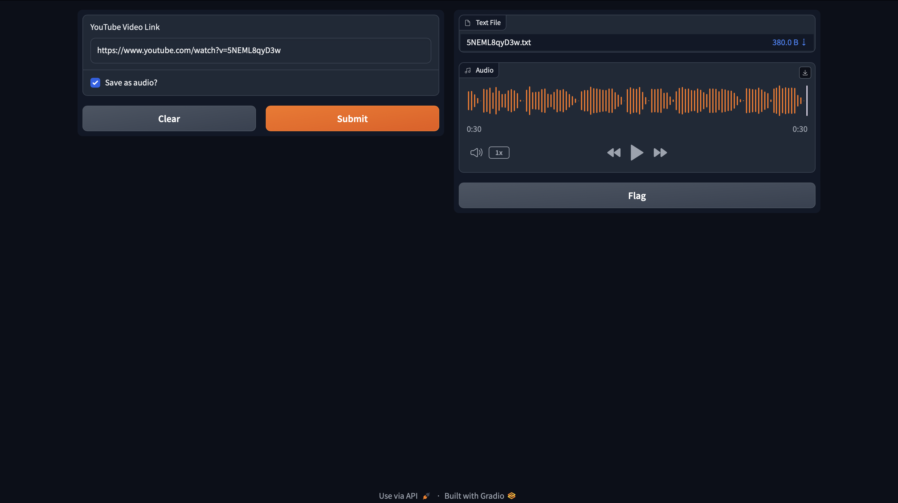

# youtube_summariser


### Project Title

YouTube Video Summarizer

### Description
This Python script allows you to extract the transcript of a YouTube video, generate a summary using the lm studion model TheBloke/Mistral-7B-Instruct-v0.2-GGUF , and provide both a text and audio summary of the video. using gradio ui for better user experience.


lm studio  | summarization using ai model.| 
|--------------|-------------|
|  |


### LM Studio 
  LM Studio is a powerful tool for using Large Language Models (LLMs) on your local machine.
  [install_LMstudio](https://lmstudio.ai)

### Project Structure

- `src/` directory contains the main source code
  - `youtube_handler.py` - Handles YouTube video extraction and transcript retrieval
  - `ml_model.py` - Implements the machine learning model for summarization
  - `file_handler.py` - Manages file-related operations
  - `main.py` - The main executable script
- `summary_text/` - Directory to store text summaries
- `summary_voice/` - Directory to store audio summaries

### Usage

1. **Clone the repository**:

   ```bash
   git clone https://github.com/ganeshnikhil/SummarizeYT.git
   cd SummarizeYT
   ```
2. **Create a virtual environment**:

   ```bash
   python -m venv venv
   ```

3. **Activate the virtual environment**:

   - On Windows:

     ```bash
     venv\Scripts\activate
     ```

   - On macOS/Linux:

     ```bash
     source venv/bin/activate
     ```

4. Install the required modules using the `requirements.txt` file:

    ```bash
    pip install -r requirements.txt
    ```

5. Run the script using command line args:

    ```bash
    python main.py 
    ```

    Follow the on-screen instructions to input the YouTube video URL.

### Configuration

- `main.py` - Main script to run the YouTube video summarizer.
- `requirements.txt` - List of required Python modules.


### Cool Stickers

[](https://www.python.org/downloads/release/python-380/)
[](https://developers.google.com/youtube/v3)
[](https://opensource.org/licenses/MIT)
